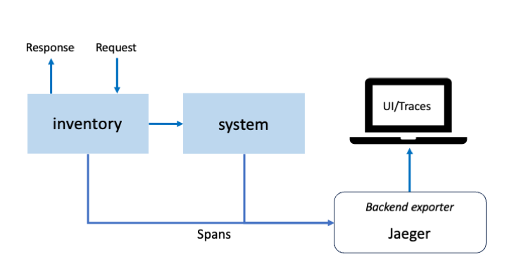
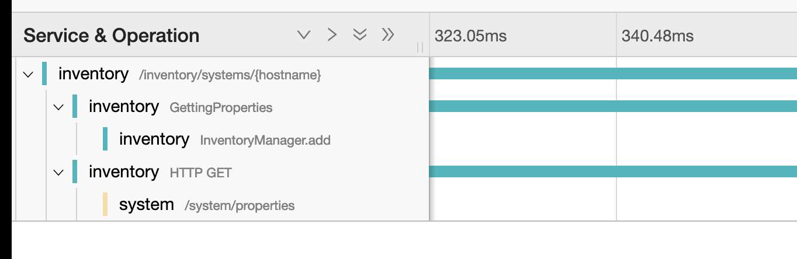

//  Copyright (c) 2022, 2023 IBM Corporation and others.
// Licensed under Creative Commons Attribution-NoDerivatives
// 4.0 International (CC BY-ND 4.0)
//   https://creativecommons.org/licenses/by-nd/4.0/
//
// Contributors:
//     IBM Corporation
//
:page-layout: guide-multipane
:projectid: microprofile-opentelemetry-jaeger
:page-duration: 20 minutes
:page-releasedate: 2023-04-01
:page-guide-category: microprofile
:page-essential: false
:page-description: Explore how to enable and customize tracing of REST service endpoint methods by using MicroProfile Telemetry and Jaeger.
:guide-author: Open Liberty
:page-tags: ['MicroProfile']
:page-permalink: /guides/{projectid}
:common-includes: https://raw.githubusercontent.com/OpenLiberty/guides-common/prod
:page-related-guides: ['guide-microprofile-opentracing', 'microprofile-opentracing-jaeger']
:imagesdir: /img/guide/{projectid}
:page-seo-title: Enabling distributed tracing in Java microservices using MicroProfile Telemetry and the Jaeger tracing system.
:page-seo-description: A getting started tutorial and an example on how to enable distributed tracing in Java microservices to easily trace request flows that span multiple resources by using MicroProfile Telemetry and Jaeger tracing system.​
:source-highlighter: prettify
:guide-author: Open Liberty

= Create and manage traces using OpenTelemetry open standards 

[.hidden]
NOTE: This repository contains the guide documentation source. To view the guide in published form, view it on the https://openliberty.io/guides/{projectid}.html[Open Liberty website].

Distributed tracing helps DevOps teams keep track of requests between microservices. MicroProfile adopts OpenTelemetry Tracing to allow developers to observe requests across their distributed systems.

// =================================================================================================
//  What you'll learn
// =================================================================================================

== What you'll learn
The use of microservices architecture may increase difficultly to see how services depend on or affect other services. Consequently, making it harder to find the source of latency or inaccuracy.

One way to increase observability of an application is by emitting traces. OpenTelemetry is a set of APIs, SDKs, tooling and integrations that are designed for the creation and management of telemetry data such as traces, metrics, and logs. MicroProfile Telemetry 1.0 adopts OpenTelemetry so your MicroProfile applications can benefit from both manual and automatic traces!

Traces represent requests and consist of multiple spans.
Spans are representative of single operations in a request and contain a name, time-related data, log messages and metadata to give information about what occurs during a transaction.

Context is an immutable object contained in the span data to identify the unique request that each span is a part of. This data is required for moving trace information across service boundaries, allowing developers to follow a single request through a potentially complex distributed system.
Exporters are components that send data to a backend service so you can visualise and monitor the generated spans.

You'll configure the provided inventory and system services to use Jaeger for distributed tracing with MicroProfile OpenTracing. You'll run these services in two separate JVMs made of two server instances to demonstrate tracing in a distributed environment. If all the components were run on a single server, then any logging software would be sufficient.


{empty} +

// =================================================================================================
//  Additional prerequisites 
// =================================================================================================

== Additional prerequisites 

Before you begin, make sure you have all the necessary prerequisites. You can export the data that MicroProfile Telemetry 1.0 collects to Jaeger. OpenTelemetry includes a simple logging exporter, which provides an easy way to check that spans are being created by viewing the data in your console. This may be helpful for debugging.

Deploy the Jaeger all-in-one executable file to start the Jaeger tracing system. The Jaeger all-in-one executable file is configured for quick local testing. You can find information about the Jaeger server and instructions for starting the all-in-one executable file in the link:https://www.jaegertracing.io/docs/1.39/getting-started/[Jaeger documentation].

Before you proceed, make sure that your Jaeger server is up and running. Jaeger can be found at the http://localhost:16686 URL.

// =================================================================================================
// Getting started
// =================================================================================================
[role='command']
include::{common-includes}/gitclone.adoc[]

The fastest way to work through this guide is to clone the Git repository and use the projects that are provided inside:

```
git clone https://github.com/openliberty/draft-guide-microprofile-telemetry.git
cd draft-guide-microprofile-telemetry
```

The start directory contains the starting project that you will build upon.

The finish directory contains the finished project that you will build.

Before you begin, make sure you have all the necessary prerequisites.

=== Try what you'll build

The finish directory in the root of this guide contains the finished application. Give it a try before you proceed.

Open a command-line session and navigate to the finish/system directory. 

```
cd finish
cd system
```

Run the following Maven goal to build the system service and deploy it to Open Liberty:

```
mvn liberty:run
```
After you see the following message in the command-line session, your system service is ready:

```
The defaultServer server is ready to run a smarter planet.
```

Make sure that your Jaeger server is running and navigate to the system properties endpoint http://localhost:9080/system/properties URL. 

A span for this request will be created by the Java Agent. Check for the span in the exporter’s endpoint.

Open a new command-line session and navigate to the inventory directory:

```
cd inventory
```
Run the following Maven goal to build the inventory service and deploy it to Open Liberty:
```
mvn liberty:run
```
Navigate to the inventory endpoint:

http://localhost:9081/inventory/systems/localhost

You should see 5 spans in the exporter’s endpoint: four spans from inventory and one span from system.


{empty} +

Stop the inventory service by pressing ```Ctrl+c``` in the terminal session.

You have collected traces using the Java Agent and Automatic Instrumentation!

// =================================================================================================
// Building the application 
// =================================================================================================
== Building the application 

You need to start the services to see basic traces appear in Jaeger.

When you run Open Liberty in development mode, known as dev mode, the server listens for file changes and automatically recompiles and deploys your updates whenever you save a new change.

Open a command-line session and navigate to the start/inventory directory. Run the following Maven goal to start the inventory service in dev mode:

```
mvn liberty:dev
```

Open a command-line session and navigate to the start/system directory. Run the following Maven goal to start the system service in dev mode:

```
mvn liberty:dev
```

After you see the following message, your application server in dev mode is ready:

```
**************************************************************
*    Liberty is running in dev mode.
```

Dev mode holds your command-line session to listen for file changes. Open another command-line session to continue, or open the project in your editor.

When the servers start, you can find the system and inventory services at the following URLs:

* http://localhost:9080/system/properties

* http://localhost:9081/inventory/systems

// =================================================================================================
// Enabling the existing Telemetry implementation 
// =================================================================================================
== Enabling Telemetry implementation 

MicroProfile Telemetry 1.0 allows you to observe traces without modifying source code in your Jakarta RESTful web service (aka JAX-RS) applications.
As you can see in the inventory service, you can enable mpTelemetry-1.0 in your server.xml:

```
<featureManager>
  <feature>mpTelemetry-1.0</feature>
</featureManager>
```

By default, MicroProfile Telemetry tracing is off. To enable any tracing aspects, specify ```otel.sdk.disabled=false``` as a config property or ```OTEL_SDK_DISABLED=false``` as an environment property for your server.

For more information on these properties, see link:https://github.com/open-telemetry/opentelemetry-specification/blob/main/specification/sdk-environment-variables.md[OpenTelemetry’s configuration documentation].

To begin, open a new command-line session and navigate to the `system` directory:

`cd system`

Start the `system` service:

`mvn liberty:run`

Navigate to the system properties endpoint:

http://localhost:9080/system/properties

A span for this request will be automatically created by MicroProfile Telemetry. Check for the span in your chosen exporter’s endpoint. For example:

image::assets/mptelemetry_system_span.png[System Spans,align="center"]
{empty} +

// =================================================================================================
// Manually create traces 
// =================================================================================================
== Manually create traces 

Automatic instrumentation only instruments Jakarta RESTful web service applications. To get further spans on other operations, such as database calls, you can add manual instrumentation to the source code.

Before instrumenting your code, the following prerequisites are required:

Third-party APIs must be made visible for your application in the `server.xml`:

```
<webApplication location="demo-microprofile-telemetry-inventory.war" contextRoot="/">
    <!-- enable visibility to third party apis -->
    <classloader apiTypeVisibility="+third-party"/>
</webApplication>
```

server.xml
[source, xml, linenums, role='code_column']
----
include::finish/inventory/src/main/liberty/config/server.xml[]
----

The OpenTelemetry API and OpenTelemetry Instrumentation Annotations must be provided as dependencies to your build path. For example, with Maven, we add the following to the `pom.xml` file:

```
<dependency>
    <groupId>io.opentelemetry</groupId>
    <artifactId>opentelemetry-api</artifactId>
    <version>1.19.0</version>
</dependency>
<dependency>
    <groupId>io.opentelemetry.instrumentation</groupId>
    <artifactId>opentelemetry-instrumentation-annotions</artifactId>
    <version>1.19.0-alpha</version>
</dependency>
```

pom.xml
[source, xml, linenums, role='code_column']
----
include::finish/inventory/pom.xml[]
----

Now you are all set to instrument your code to manually create traces. 

Start by injecting a `Tracer` and `Span` object:

```
@Inject
Tracer tracer;

@Inject
Span getPropertiesSpan;
```

InventoryResource.java
[source, java, linenums, role='code_column']
----
include::finish/inventory/src/main/java/io/openliberty/guides/inventory/InventoryResource.java[]
----

This can then be used to create spans. For example, a span called GettingProperties starts and an event is added before the system service is called:

```
getPropertiesSpan = tracer.spanBuilder("GettingProperties").startSpan();
Properties props = manager.get(hostname);
try(Scope scope = getPropertiesSpan.makeCurrent()){
    ...
    getPropertiesSpan.addEvent("Received properties");
}
finally{
    getPropertiesSpan.end();
}
```

InventoryResource.java
[source, java, linenums, role='code_column']
----
include::finish/inventory/src/main/java/io/openliberty/guides/inventory/InventoryResource.java[]
----

You can also create new spans by annotating methods in any Jakarta CDI beans using @WithSpan. The InventoryManager.java file in the demo application creates a span when a new system is added to the inventory. The hostname method parameter is annotated with the @SpanAttribute annotation to indicate that it is part of the trace:

```
@WithSpan
public void add(@SpanAttribute(value = "hostname") String hostname, Properties systemProps) {
    ...
}
```

InventoryManager.java
[source, java, linenums, role='code_column']
----
include::finish/inventory/src/main/java/io/openliberty/guides/inventory/InventoryManager.java[]
----

A span created using the @WithSpan annotation can be given a name. For example, this span is given the name list:

```
@WithSpan("list")
public InventoryList list() {
    ...
}
```

InventoryManager.java
[source, java, linenums, role='code_column']
----
include::finish/inventory/src/main/java/io/openliberty/guides/inventory/InventoryManager.java[]
----

// =================================================================================================
// Testing the application 
// =================================================================================================
== Testing the application 

Now that you created the spans manually, we can build the inventory service and deploy it to Open Liberty:

cd inventory

mvn liberty:run

Navigate to the inventory endpoint:

http://localhost:9081/inventory/systems/localhost

You should see five spans in the exporter’s endpoint: four spans from inventory and one span from system, as shown in the following example:


{empty} +

These spans are all part of one single trace that is emitted from the request to the endpoint. It is therefore easier to identify the source of inaccuracy or latency in a single request by debugging spans individually.

For more information, see link:https://opentelemetry.io/docs/instrumentation/java/manual/[OpenTelemetry’s manual instrumentation documentation].


=== Running the tests

Since you started Open Liberty in dev mode, run the tests for the system and inventory services by pressing the enter/return key in the command-line sessions where you started the services.

When you are done checking out the services, exit dev mode by pressing ```CTRL+C``` in the shell sessions where you ran the system and inventory services, or by typing ```q``` and then pressing the ```enter/return``` key.

Finally, stop the Jaeger service that you started in the Additional prerequisites section.


// =================================================================================================
// Great work! You're done!
// =================================================================================================

== Great work! You're done!

You developed an application that creates and manages traces using MicroProfile Telemetry 1.0 and Open Liberty.

include::{common-includes}/attribution.adoc[subs="attributes"]
